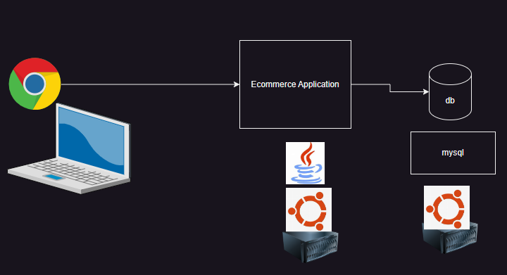
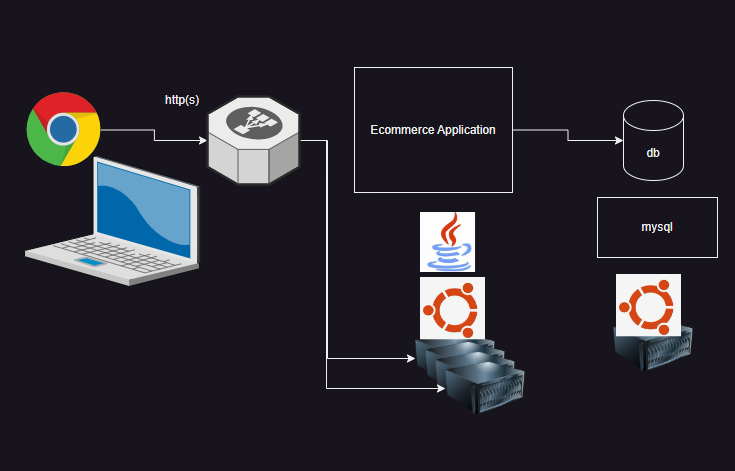

# Story of Kubernetes (k8s)

___

* **Monolithic Systems**
* Lets assume we are builing an ecommerce system

___

* Ecommerce has different modules
  * user registration and management
  * administration
  * catalog
  * warehousing
  * logistics
  * cart
  * payment
  * notifications

* Scaling: During the seasonal sale, we have more than normal users accesing our application, we need to scale  servers

___

* **Application Updates:**
  * We need to increase number of servers if we need zero downtime
  * Rollout the new version on servers **(atleast one  server should be up)**
  * In the cases of problems with latest version **(Rolling back)** but the above steps are challenging and require expertise

___

## Microservices
  
* Applications are broken down into individually runnable services
* [Read](https://cloud.google.com/kubernetes-engine/kubernetes-comic) the comic book
* Google has a history of running containers and to operate on this containers they have built orchestration systems
  * OMEGA
  * BORG
* Docker was released and Was a popular option to run containers
* Google has written the orchestration system based on their experince with containers in GOlang which is called as Kubernetes and made it opensource.
* Kubernetes, also known as K8s, is an open source system for *automating deployment, scaling, and management of containerized applications.*
* Running containers for Production Scenarios is what k8s does.
* Alternatives to k8s
  * Docker Swarm
  * Apache Mesos
  * AWS ECS
* Kubernetes creates a cluster which is combination of multiple nodes categorized as
* **Worker node (node):**
  * Here the application workloads are executed
* **Master Node:**
  * They manage the cluster
