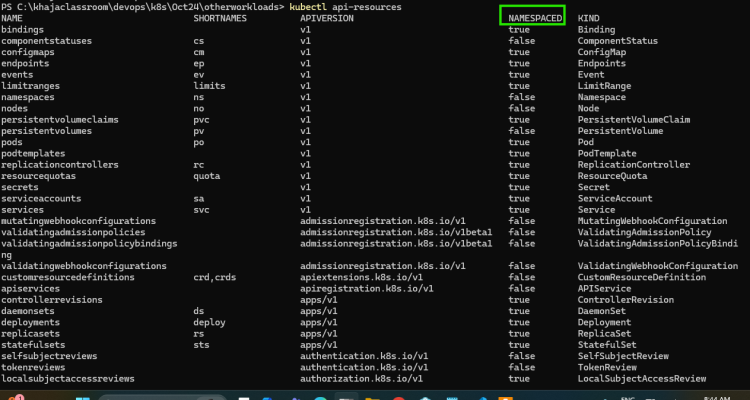
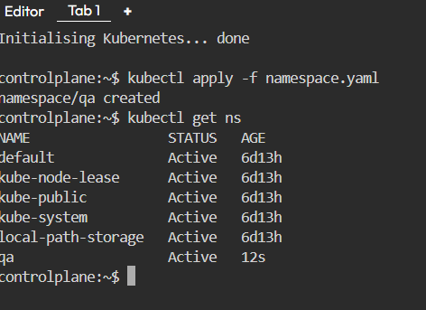
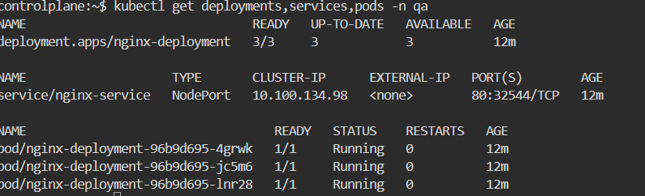

# Daemonsets

* Daemonsets are used to run a pod on each node or selected nodes
* They are useful for running agent like  softwares in container
* Daemonset support rolling updates like deployments
* Lets write a simple spec to run a dameonset
* [Refer Here](https://kubernetes.io/docs/concepts/workloads/controllers/daemonset/) for offical docs
* [Refer Here](https://github.com/rithwiksrivastav4/kubernetes/blob/main/otherworkloads/demonsets/hello-ds.yaml) for the changes done

----

# Jobs and CronJobs

* [Refer Here](https://kubernetes.io/docs/concepts/workloads/controllers/cron-jobs/) for cronjob demo
* Lets write a cronjob which runs every day at 11:30 PM
* [Refer Here](https://github.com/rithwiksrivastav4/kubernetes/blob/main/otherworkloads/cronjobs/hello-cronjobs.yaml)

----

# Namespace

* [Refer Here](https://kubernetes.io/docs/concepts/overview/working-with-objects/namespaces/) for official docs
* In kubernetes we have api-resources
* Resources are classified into two scopes
  * Namespace scoped resources:
    * Namespace true indicates namespace scoped resources
  * Cluster scoped resources
    * Namespaced false indicates cluster scoped resources


----

* Exercise:
  * create a qa namespace (use manifest)
  * [Refer here](https://github.com/rithwiksrivastav4/kubernetes/blob/main/otherworkloads/namespaces/namespace.yaml) for namespace manifest

  ```bash
  kubectl apply -f <filename.yaml>
  ```

  * create a nginx deployment with 3 replicas in qa namespace
  * create a service with matches the labels in qa namespace
  * [Refer here](https://github.com/rithwiksrivastav4/kubernetes/blob/main/otherworkloads/namespaces/nginx-svc.yaml) for nginx deployment and service manifest and changes done
  
  ```bash
  kubectl apply -f <filename.yaml>
  ```

  * create an alpine pod in default namespace, try pinging to the nginx service in qa namespace with name not ip
  * [Refer here](https://github.com/rithwiksrivastav4/kubernetes/blob/main/otherworkloads/namespaces/alpine-ping.yaml) for apline manifest
  
  ```bash
  kubectl apply -f alpine-ping.yaml
  ```
  
  * Test Connectivity
  * Once the pod is running:
  
  ```bash
  kubectl exec -it alpine-ping -- ping nginx-service.qa.svc.cluster.local
  ```
  
  * Key Details
    * FQDN Structure: Use < service-name >.< namespace >.svc.cluster.local for cross-namespace communication

    * Package Installation: The manifest automatically installs iputils (contains ping) using Alpine's package manager

    * DNS Resolution: Works by default in Kubernetes clusters with CoreDNS/kube-dns enabled

----

* Verification
  * Check successful installation of ping utility:

```bash
kubectl exec alpine-ping -- which ping
# Should return: /usr/bin/ping
```

* verify deployment with this command

```bash
kubectl get deployments,services,pods -n qa
```



