# Kubernetes Storage

* CSI is a storage interface for k8s
* List of CSI drivers [Refer Here](https://kubernetes-csi.github.io/docs/drivers.html)
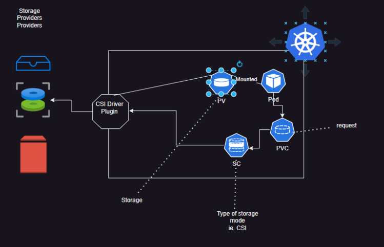
* [Refer Here](https://kubernetes.io/docs/concepts/storage/persistent-volumes/) for official docs of PVs
* [Refer Here](https://kubernetes.io/docs/concepts/storage/storage-classes/) for official docs of Storage Classes

* Access Modes
  * RWO – ReadWriteOnce (Suitable for block storages like EBS,  Azure Disk, Persistent Disk)
  * ROX – ReadOnlyMany (Any disk)
  * RWX – ReadWriteMany (Typically fileshares or blob storages)
  * RWOP – ReadWriteOncePod (Suitable for block storages like EBS, Azure Disk, Persistent Disk)

* [Refer Here](https://learn.microsoft.com/en-us/azure/aks/azure-csi-disk-storage-provision) for using Azure Disk as PV

## Lets create a mysql Pod where we create a persitent volume dynamically

* Mysql with pvc [Refer Here](https://github.com/rithwiksrivastav4/kubernetes/commit/57f281a07debd71ee09667ba04d98891e705be2c) for the changes done.

* Exercise: Try running mongodb with pvc and postgres with pvc

* mongodb with pvc [refer here](https://github.com/rithwiksrivastav4/kubernetes/commit/10b479bc4c9adbf9b724104aec4ae3fe4f868951) for changes done

* postgres with pvc [refer here](https://github.com/rithwiksrivastav4/kubernetes/commit/a192e659bc5f8c7cac0be11f09b871dae470c7ee) for chnages done
* command to execute the pod

```bash
kubectl exec -it postgres -- psql -U rootroot -d postgres
```

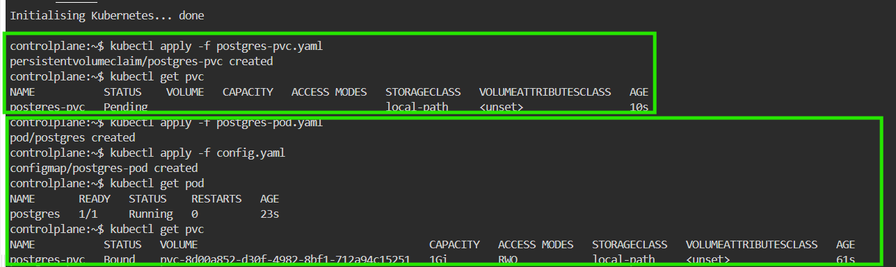

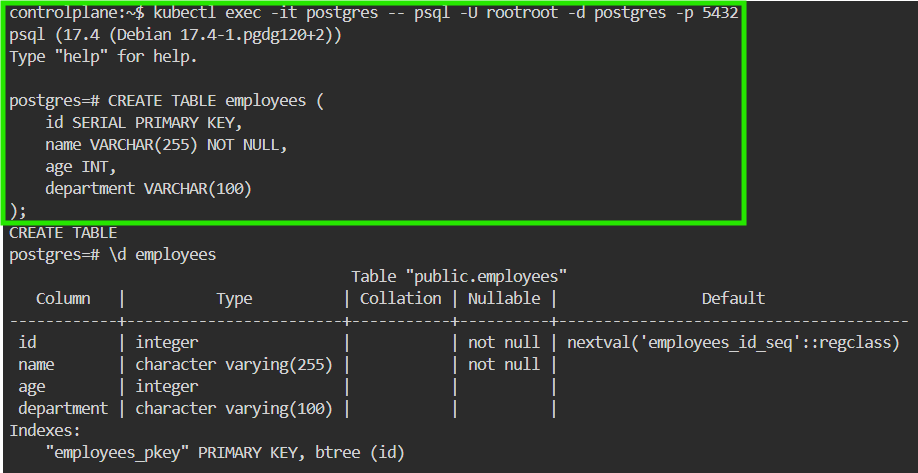

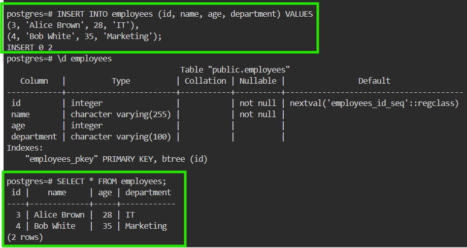

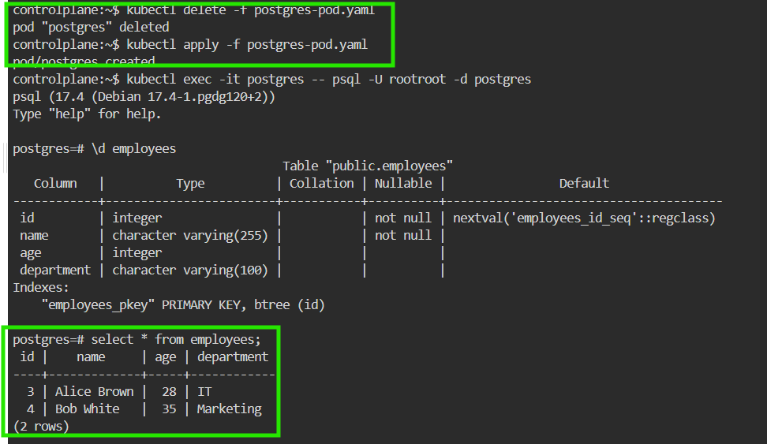

----

* Used killercoda for expermentation or you can use managed k8s cluster , first check which stroage class in the killercode use this command

```bash
kubectl get sc 
```

* pvc will not in the runing state unless the pod and container is running

```bash
kubectl apply -f <filename>.yaml
```

* Then make sure your pvc is running

```bash
kubectl get pvc 
```

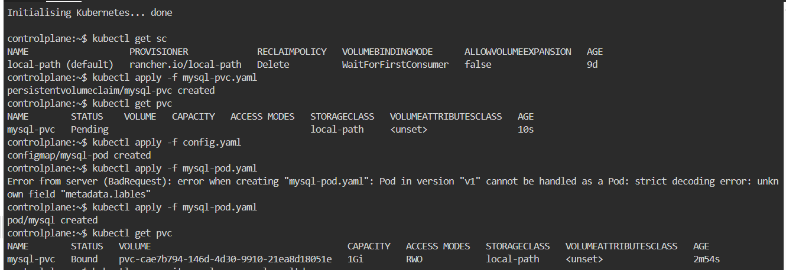

* Then execute this command to see the mysql is working 

```bash
kubectl exec -it mysql -- mysql -u ltdevops -p
```

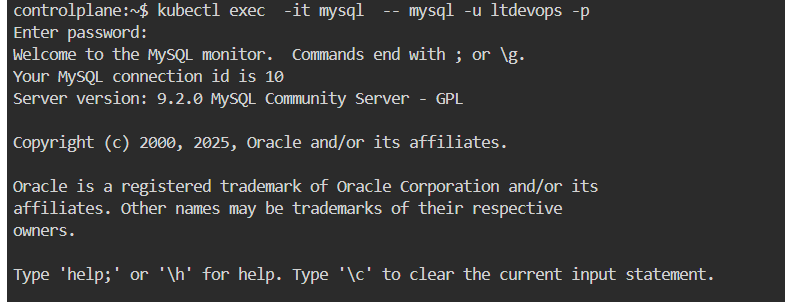

* see the database and use the database 

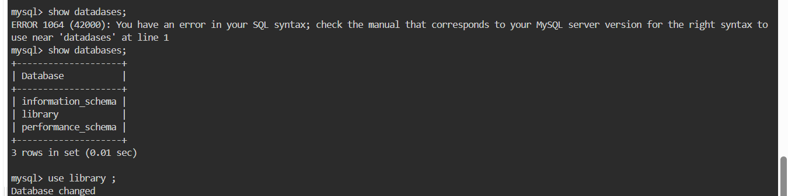

* create a table


* Insert values into the table and see the table

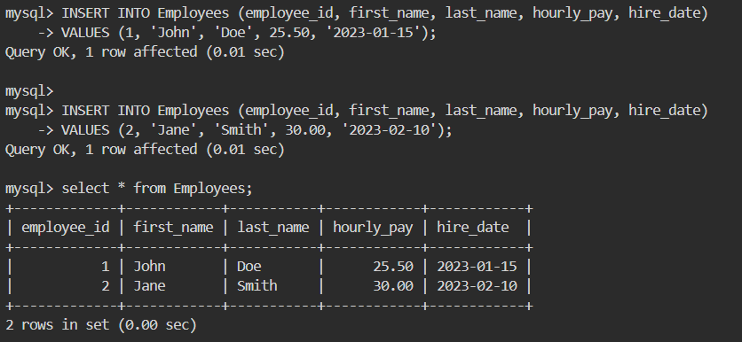

* The main use of pvc is even after deleting the pod the data in pvc remains safely.
* even after the pod is deleted and again recreated with the same pvc the previous data is reclaimed

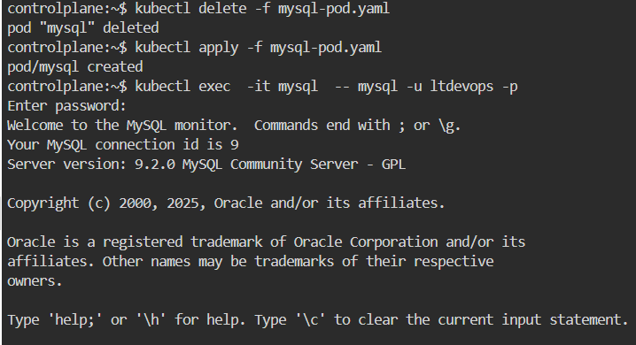

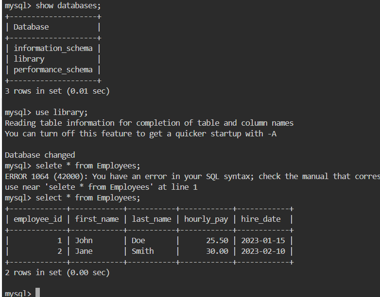

----

## Necesity for database cluster

* To have HA we run database in multiple servers in the case of k8s multiple pods
* IN db cluster we have multiple servers and each server will have its own storage
* So we need to create pods and each pod should have its own persistent volume

* challenge to create cluster with deployments:
  * managing multiple PVs
  * pod names are not predictable: database clusters generally will have predictable endpoints (read endpoint, write endpoint)

* So we need a way to create
  * multiple pods and pvs
  * pod names should be predicatable
  * all of the above are acheived with stateful sets
