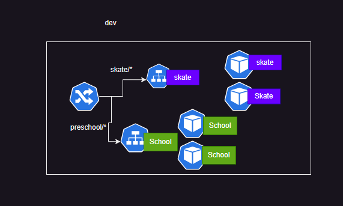
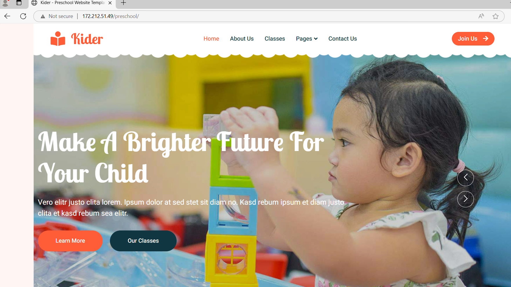
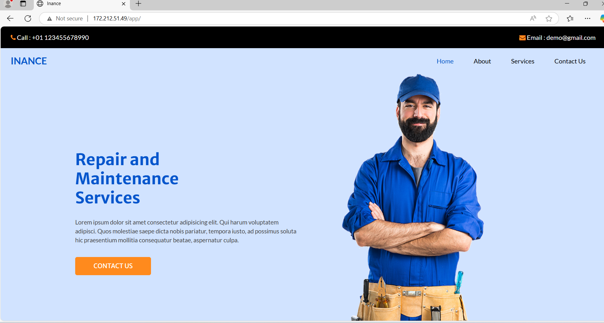
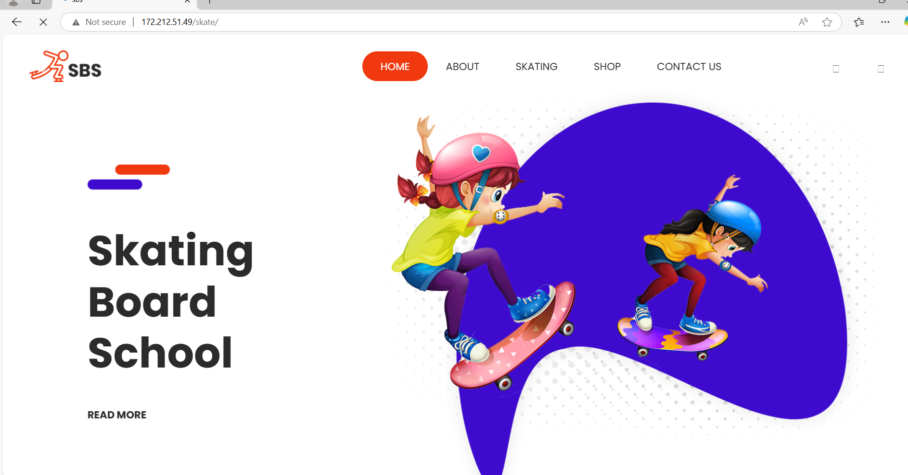
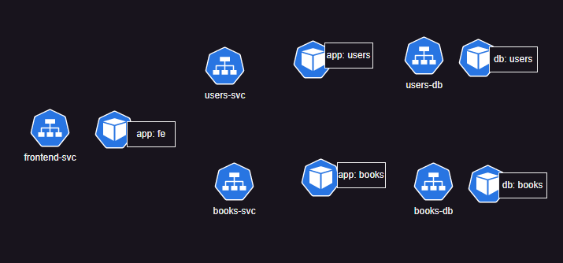
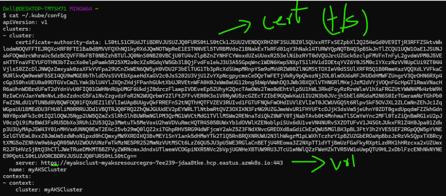
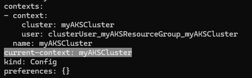
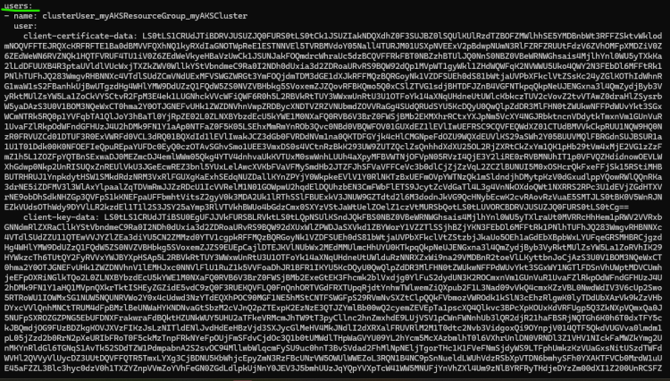
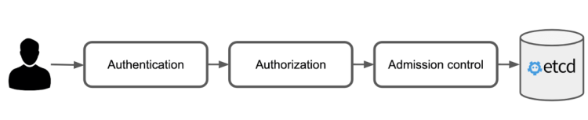

# Ingress and Ingress Controllers

* [Refer Here](https://kubernetes.io/docs/concepts/services-networking/ingress/) for official docs and [Refer Here](https://kubernetes.io/docs/concepts/services-networking/ingress-controllers/) for ingress Controllers
* Lets look at our apps
  * shaikkhajaibrahim/preschool:1.1:
    * This runs a preshool app on path /preschool on port 80
  * shaikkhajaibrahim/skateboard:1.0
    * This runs a skate board app on path /skate on port 80


* [Refer Here](https://github.com/rithwiksrivastav4/kubernetes/commit/2dbf7c4c4c6c1e6df85eb18aaf00c65d57c4514d) for the deployment manifest with images and service with clusterip
* K8s doesnot have a default ingress implementation, for this exercise lets use nginx ingress controller

```bash
kubectl apply -f https://raw.githubusercontent.com/kubernetes/ingress-nginx/main/deploy/static/provider/cloud/deploy.yaml
```

* Now lets write ingress rules [Refer Here](https://github.com/rithwiksrivastav4/kubernetes/commit/2dbf7c4c4c6c1e6df85eb18aaf00c65d57c4514d#diff-27de092b9888fec9a5745a29ec8ac9d2d959f3fd2a8213e163c1334c84188c77)

----

# Installing nginx ingress controller

* To install the NGINX Ingress Controller using kubectl, follow these steps:

## Steps to Install NGINX Ingress Controller

**1. Create a Namespace:**

* First, create a namespace for the NGINX Ingress Controller:

```bash
kubectl create namespace ingress-nginx
```

**2. Apply the NGINX Ingress Controller Manifest:**

* Use the following command to deploy the NGINX Ingress Controller by applying the official manifest:

```bash
kubectl apply -f https://raw.githubusercontent.com/kubernetes/ingress-nginx/main/deploy/static/provider/cloud/deploy.yaml
```

**3. Verify the Deployment:**

* Check that the NGINX Ingress Controller pods are running:

```bash
kubectl get pods --namespace ingress-nginx
```

**4. Check the Service:**

* To see if the NGINX Ingress Controller has been assigned a public IP address, run:

```bash
kubectl get svc --namespace ingress-nginx
```

* Look for the service of type LoadBalancer and note its EXTERNAL-IP. It may take a few minutes for the IP to be assigned.

**5. Troubleshooting:**

* If the EXTERNAL-IP status shows as Pending, you can investigate further with:

```bash
kubectl describe svc -n ingress-nginx ingress-nginx-controller
```






* By following these steps, you will have successfully installed the NGINX Ingress Controller on your Kubernetes cluster. This setup allows you to manage incoming traffic and route it to your services based on defined rules.

**Citations:**
[1] https://help.hcl-software.com/devops/test/hub/10.2.0/docs/topics/t_install_nginx.html
[2] https://spacelift.io/blog/kubernetes-ingress
[3] https://docs.k0sproject.io/v1.25.4+k0s.0/examples/nginx-ingress/
[4] https://gcore.com/docs/cloud/kubernetes/networking/install-and-set-up-the-nginx-ingress-controller
[5] https://docs.nginx.com/nginx-ingress-controller/installation/installing-nic/installation-with-manifests/
[6] https://learn.microsoft.com/da-dk/azure/aks/create-nginx-ingress-private-controller
[7] https://devopscube.com/setup-ingress-kubernetes-nginx-controller/
[8] https://stacksimplify.com/azure-aks/azure-kubernetes-service-ingress-basics/

----

## Kubernetes Metrics Service

* [Refer Here](https://kubernetes-sigs.github.io/metrics-server/) for kubernetes metrics server

## Horizontal Pod Autoscaler

* [Refer Here](https://kubernetes.io/docs/tasks/run-application/horizontal-pod-autoscale/)
* [Refer Here](https://github.com/rithwiksrivastav4/kubernetes/commit/b1b8ec41bb4da87ea37bb933d7eb05531d3c4327) for hpa’s added

## Vertical Pod Autoscaler

* [Refer Here](https://kubernetes.io/docs/concepts/workloads/autoscaling/) for offical docs
* [Refer Here](https://github.com/rithwiksrivastav4/kubernetes/commit/a69e7ebb8e76ac2d778f602875985bdceb6a8f0b) for vertical pod auto scaling

## Network Policy

* [Refer Here](https://kubernetes.io/docs/concepts/services-networking/network-policies/) for Network Policy
* If you want to control traffic flow at the IP address or port level (OSI layer 3 or 4), NetworkPolicies allow you to specify rules for traffic flow within your cluster, and also between Pods and the outside world. Your cluster must use a network plugin that supports NetworkPolicy enforcement.
* NetworkPolicies are not supported by all CNIs
* Ensure you have a CNI plugin with network policies enabled


```yaml
---
apiVersion: networking.k8s.io/v1
kind: NetworkPolicy
metadata:
  name: users-db-np
spec:
  podSelector:
    matchLabels:
      db: users
  policyTypes:
    - Ingress
  ingress:
    - from:
        - podSelector:
            matchLabels:
              app: users
```

----

# Kubernetes Authentication and Authorization

* Kubeconfig file contains
  * clusters information: Foreach cluster we have url and cluster certificate

  * context: which cluster and which namespace is default

  * users:

* Overview

* Authentication: (idproof)
  * K8s does not have inbuild identity system
  * k8s authentication is pluggable
  * k8s usermanagement is external identity
    * azure: azure ad
    * aws: iam
    * oidc
    * ad
* Authorization:
  * Authorization is also pluggable but RBAC (Role Based ACcess control) is most widely adopted authorization technique
  * Role:
    * You define the permission level at namespace
  * RoleBinding
    * Attaching a Role to a user/serviceaccount
  * ClusterRole:
    * You define the permission level at cluster
  * ClusterRoleBinding
    * Attaching a clusterrole to a user/serviceaccount
* ServiceAccounts: This is part of k8s [Refer Here](https://kubernetes.io/docs/concepts/security/service-accounts/) for official docs

* Role example

```yaml
---
apiVersion: rbac.authorization.k8s.io/v1
kind: Role
metadata:
  namespace: default  # Specify the namespace
  name: readonly
rules:
  - apiGroups: ["*"]
    resources: ["*"]
    verbs: ["get", "list", "watch"]
```

* Role Binding

```yaml
---
apiVersion: rbac.authorization.k8s.io/v1
kind: RoleBinding
metadata:
  name: readonly-user-binding
  namespace: default  # Specify the namespace
subjects:
  - kind: User  # or Group if using groups
    name: user1aksadmin@yourdomain.com  # The user's email
    apiGroup: rbac.authorization.k8s.io
roleRef:
  kind: Role
  name: readonly
  apiGroup: rbac.authorization.k8s.io
```

* Every Pod by default mounts the service account token of default service account, which is not a good practice
