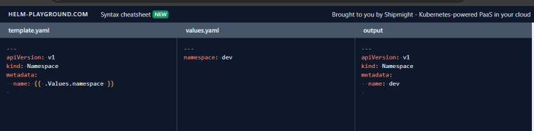

# CRD (Custom Resource Definitions) & Operators

* Kubernetes gives the extension mechanism where we create
  * CRD (Custom resource definition)
  * Operators: Refer Here
    * They create reconcile loop
  * Lifecycle => CRD + Operator

----

# Problem 1: Static YAML Manifests

* K8s manifests are static in nature
* During deployments we will have changes to handle
  * image tags
  * labels
  * namespaces
* We have to manually change the manifests

----

# Problem 2: No Reusability

* Manifest YAML files are not reusable

# Solutions

1. Helm:
2. This works as a package manager to kubernetes
3. we need to install helm
4. Kustomize:
5. This works as if manages multiple environments
6. This works with native kubectl

----

# Helm

* [Refer Here](https://helm.sh/) for official docs and [Refer Here](https://helm.sh/docs/intro/install/) to install helm
* In helm

* Components:
  * Helm (client)
  * Repository (Which hosts the charts)
  * Chart (An individual package)

----

## Create a helm chart for basic deployment

* **YAML Manifest**

```yaml
---
apiVersion: apps/v1
kind: Deployment
metadata:
  name: nginx
spec:
  replicas: 3
  selector:
    matchLabels:
      app: nginx
  template:
    metadata:
      labels:
        app: nginx
    spec:
      containers:
      - name: nginx
        image: nginx:1.27
        resources:
          limits:
            memory: "128Mi"
            cpu: "500m"
        ports:
        - containerPort: 80
---
apiVersion: v1
kind: Service
metadata:
  name: nginx-svc
spec:
  type: ClusterIP
  selector:
    app: nginx
  ports:
  - port: 80
    targetPort: 80
```

----

## Helm Charts

* Lets create a helm chart
* helm create activity1
* A folder called as activity1 is create with following content

* [Refer Here](https://helm.sh/docs/topics/charts/) for official docs on Charts
* Helm use go templating syntax [Refer Here](https://helm.sh/docs/chart_template_guide/)
* Use helm online validator to verify expression [Refer Here](https://helm-playground.com/#t=LQhQFMA8EMFsAcA24BcACA3h4aB0A1aRAV3AGdcBLAF3FjLQB81qB7ATTkSbQDtLeAE3C9qaAExoAvlNBA&v=LQhQEsBcFMFsGcBcACA2gIgGbgE70ugDTLrzQDGA9gHYAm6AuqEA)
* Helm creates manifests and passes it to the kubectl after replacing dynamic expression (template expressions)

* [Refer Here](https://helm-playground.com/cheatsheet.html) for synaxes used in Helm
* [Refer Here](https://github.com/rithwiksrivastav4/kubernetes/tree/main/helm) for the helm chart.
* Now create a chart repository and push the chart to repository

----

# Kustomize

* Kustomize simplifies templating without strange expressions
* [Refer Here](https://kustomize.io/) for official docs
* [Refer Here](https://kubernetes.io/docs/tasks/manage-kubernetes-objects/kustomization/) for kustomize documents
* [Refer Here](https://kubernetes.io/docs/tasks/manage-kubernetes-objects/kustomization/)
* [Refer Here](https://github.com/kubernetes-sigs/kustomize/tree/master/examples/multibases) for multi base

----

# Elastic Kubernetes Service (EKS)

* This is kubernetes as a service offering from AWS
* AWS Service Integrations: (Private integrations)
  * AWS has VPC CNI where every pod gets an ip address from vpc range
  * AWS services can be linked to AWS load Balancers
  * AWS EKS provides Application Load Balancer Ingress controller
  * AWS EKS provides necessary CSI implementations (StorageClasses) to use
  * AWS EBS Disks
  * AWS EFS
  * AWS FSx
  * AWS S3
* EKS offers cluster node autoscaling
  * Cluster autoscaler
  * Karpenter
* EKS can be integrated with IAM to bring in AWS users or with external identity servers
* What are different EKS offerings ?
  * EKS (Completely on AWS)
    * Compute options
      * EC2
      * Fargate
  * EKS on Outposts (Hybrid cloud)
  * EKS Anywhere (distribution)
    * Onprem
  * EKS creation options
    * Console
    * cli
    * eksctl Refer Here
    * terraform (CI/CD)
