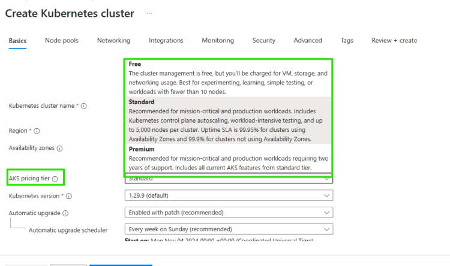

# Elastic Kubernetes Services (EKS)

* [Refer Here](https://eksctl.io/) for eksctl and [Refer Here](https://eksctl.io/installation/) for installation
* [Refer Here](https://eksctl.io/usage/schema/) for schema of eksctl
* Ensure AWS CLI is installed and user is configured
* To store data in persistent volume ensure you have configured proper iam roles [Refer Here](https://docs.aws.amazon.com/eks/latest/userguide/ebs-csi.html)
* [Refer Here](https://github.com/aws/eks-charts) for helm charts
* Find helm charts for setting up
  * storage classes
  * use aws secrets manager mounting secrets
* AWS Service Integrations
  * Network based resources
    * Examples
      * RDS
      * EC2
      * ECS
    * either create the resources and eks in same network or create a peering connection (private)
  * Non network based resources
    * Examples
      * S3
      * Dynamodb
    * Create vpc endpoints
  * IAM Roles: Ensure you create necessary iam roles to k8s cluster
* [Refer Here](https://github.com/asquarezone/KubernetesZone/commit/a7a214213bf706def3805d3045634fa2e37a3fc9) for EKS cluster config
* Cluster Autoscaling: Increasing number of nodes
  * AWS provides two options
    * cluster autoscaler: is autoscaling (like asg)
    * karpenter: it automatically increases number of nodes with fast provisioning [Refer Here](https://karpenter.sh/) and [Refer Here](https://karpenter.sh/docs/getting-started/getting-started-with-karpenter/) for steps
* Backups:
  * [Refer Here](https://velero.io/) for velero
  * [Refer Here](https://aws.amazon.com/blogs/containers/backup-and-restore-your-amazon-eks-cluster-resources-using-velero/) velero with eks

* Upgrades:

----

## Storing Secrets in K8s

* K8s secrets are just encoded values, so we need vaults
* Popular vaults
  * Hashicorp vault
  * aws secrets manager
  * azure key vault
* All the secrets can be mounted with the help of
  * CSI Driver
  * SecretProvider

----

# AKS

* AKS Pricing Tier

* Operations:
  * Storage Classes and CSI [Refer Here](https://learn.microsoft.com/en-us/azure/aks/csi-storage-drivers)
  * Azure Key Vault (Secrets) [Refer Here](https://learn.microsoft.com/en-us/azure/aks/csi-secrets-store-driver)
  * Backup:
    * Velero (Opensource tool)
    * [Refer Here](https://learn.microsoft.com/en-us/azure/backup/azure-kubernetes-service-backup-overview) for overview and [Refer Here](https://learn.microsoft.com/en-us/azure/backup/azure-kubernetes-service-cluster-backup) for backup natively
  * Upgrades: [Refer Here](https://learn.microsoft.com/en-us/azure/aks/upgrade-cluster)
* Integrations:

* [Refer Here](https://learn.microsoft.com/en-us/azure/service-connector/tutorial-python-aks-sql-database-connection-string?tabs=azure-portal&pivots=workload-id) for Azure SQL
* Azure storage account [Refer Here](https://learn.microsoft.com/en-us/azure/service-connector/tutorial-python-aks-storage-workload-identity?tabs=azure-portal#create-service-connection-with-service-connector-preview)

----

# Service Mesh

* Consider this architecture

* [Refer Here](https://aws.amazon.com/what-is/service-mesh/) for service mesh
* Features
  * mTLS
  * Circuit breaker
  * Traffic Splitting
  * A/B Testing
  * Retry logic
  * Fault injections
  * Network Observability

* Tools
  * Istio: installation ([Refer Here](https://istio.io/latest/docs/setup/install/helm/)) Custom Resources (Virtual Service, Destination Rules, Gateway)

* linkerd
* Istio on Azure [Refer Here](https://learn.microsoft.com/en-us/azure/aks/istio-about) and on AWS [Refer Here](https://aws.amazon.com/blogs/opensource/getting-started-with-istio-on-amazon-eks/)
