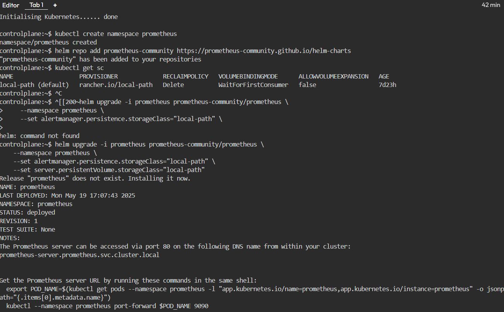
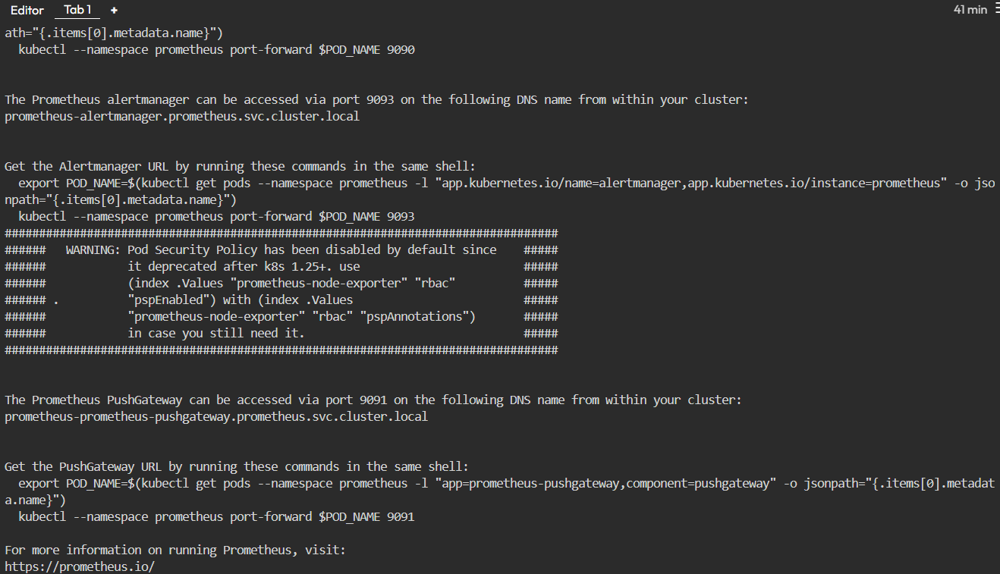
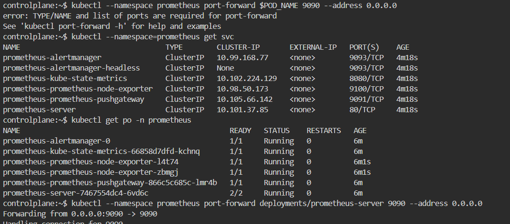

# Observability

* Google has released in a book in 2016 about how google runs production called it as [Site Reliability Engineering](https://www.google.co.in/books/edition/Site_Reliability_Engineering/tYrPCwAAQBAJ?hl=en&gbpv=0)
* [Site Reliability Engineering Overview](https://directdevops.blog/2019/10/22/site-reliability-engineering-overview/)
* [Golden Signals](https://sre.google/sre-book/monitoring-distributed-systems/)
* SLIs, SLOs and SLAs
* Observability

----

# Prometheus and Grafana

* [Prometheus Architecture](https://prometheus.io/docs/introduction/overview/#architecture)
* Installing Prometheus on kubernetes
  * [Helm Chart](https://docs.aws.amazon.com/eks/latest/userguide/deploy-prometheus.html)
  * using Prometheus Operator [Refer Here](https://github.com/prometheus-operator/prometheus-operator)
* [PromQL Cheatsheet](https://promlabs.com/promql-cheat-sheet/)
* Grafana: Installation [Refer Here](https://grafana.com/docs/grafana/latest/setup-grafana/installation/kubernetes/) and [Refer Here](https://grafana.com/docs/grafana/latest/setup-grafana/installation/helm/) for helm charts
* Getting logs from kubernetes
  * **Fluentd**
  * **loki**
  * **elastic beats**
* Prometheus Operator usage [Refer Here](https://coralogix.com/guides/prometheus-monitoring/prometheus-operator-basics-quick-tutorial/)

----

# Making Applications Observable

* Getting **Metrics** from application into Prometheus
  * Exporters: To get metrics from well known servers
  * In the application code expose prometheus metrics endpoint

* **Logs:**
  * Any enterprise apps generate logs
  * If the logs are written to files use log agents (fluentd)
  * Developers can code to directly send logs to centralized log server
* **Traces:**
  * For sending traces of your application to almost any tool there is a standard called as [open telemetry](https://opentelemetry.io/)
