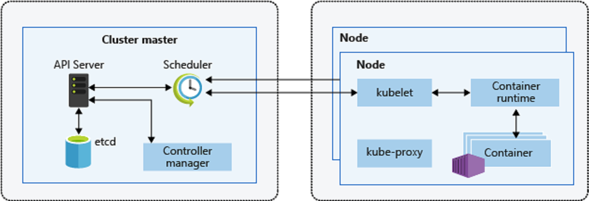
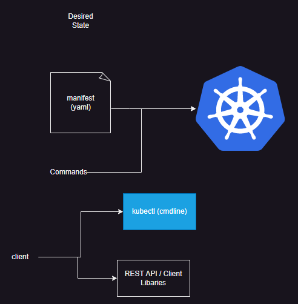
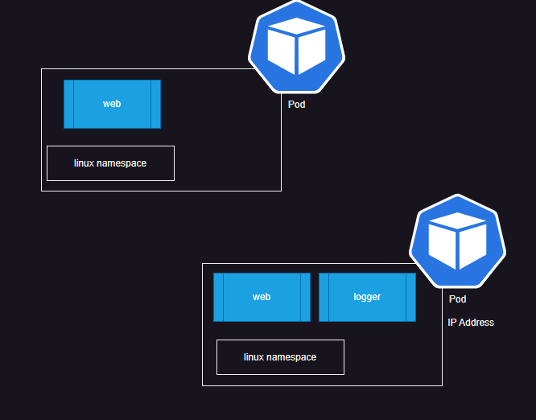

# Kubernetes Architecture

[Refer Here](https://directdevops.blog/2019/10/09/kubernetes-introduction/) for introduction to  k8s

* We express our desired state in yaml or imperative command and use a client ( kubectl) to communicate with k8s and k8s does the rest

* For master and node components [Refer Here](https://directdevops.blog/2019/10/10/kubernetes-master-and-node-components/)

---

## Ways to setup Kubernetes

* Single System (Developer): This is workstation environment for developmental purposes, Here we have following major options
  * minikube
  * kind
* Self Hosted
  * kubeadm
  * kubespray (install k8s using ansible )
* Cloud Hosted
  * AWS: Elastic Kubernetes Services (EKS)
  * Azure: Azure Kuberenetes Services (AKS)
  * GCP: Google Kubernetes Engine (GKE)

---

## Kubernetes stopped supporting docker

* kubernetes uses a interface called as CRI (Container Runtime Interface)
* kubernetes used to ship dockershim to interact with docker containers
* In K8s release 1.21 dockershim was removed [Refer Here](https://kubernetes.io/blog/2020/12/02/dont-panic-kubernetes-and-docker/)
* Mirantis and many other communties have developed CRI for docker [Refer Here](https://github.com/Mirantis/cri-dockerd)

---

## Kubernetes workloads

* Pod
* ReplicaSet/ReplicationController
* Deployment
* DaemonSet
* StatefulSet
* Service
* Ingress
* Labels
* Namespaces
* …

---

# Pod

* This is the smallest unit of creation by k8s
* A Pod has one or more containers in it
* Every Pod gets a unique ipaddress

