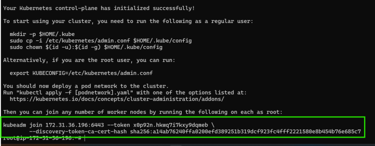
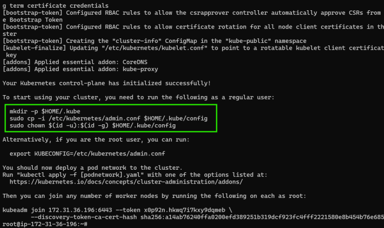
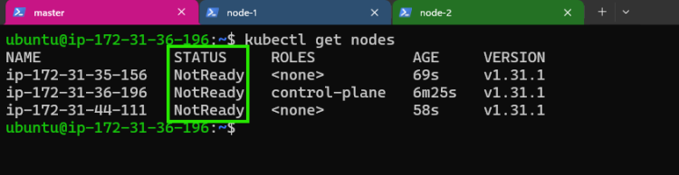
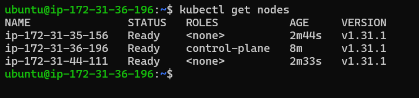

# K8s Installation (Self hosted)

------------------------------

* Lab setup
  * 3  ubuntu 22.04
  * ensure they can reach each other
* For installation of  k8s we will be using kubeadm
* High Level overview
  * install docker on all nodes
  * install cri-dockerd on all nodes
  * installing kubeadm, kubectl on all nodes
  * initialize the cluster on master node and this command gives join command which we will be executing on nodes
  * Configure kubectl
  * For Networking between Pods, Kubernetes needs CNI-Plugins
  * We will be installing Flannel CNI Plugins
* [Refer Here](https://kubernetes.io/docs/setup/production-environment/tools/kubeadm/install-kubeadm/) for kubeadm install
* for user data

```bash
#!/bin/bash
curl -fsSL https://get.docker.com -o install-docker.sh
sh install-docker.sh
```

---

* Installing CRI-dockerd [Refer Here](https://github.com/Mirantis/cri-dockerd/releases) for releases page on all nodes

```bash
cd /tmp
wget https://github.com/Mirantis/cri-dockerd/releases/download/v0.3.15/cri-dockerd_0.3.15.3-0.ubuntu-jammy_amd64.deb
sudo dpkg -i cri-dockerd_0.3.15.3-0.ubuntu-jammy_amd64.deb
```

---

* Install kubeadm, kubectl, kubelet on all nodes [Refer Here](https://kubernetes.io/docs/setup/production-environment/tools/kubeadm/install-kubeadm/#installing-kubeadm-kubelet-and-kubectl)

```bash
sudo apt-get update
# apt-transport-https may be a dummy package; if so, you can skip that package
sudo apt-get install -y apt-transport-https ca-certificates curl gpg
curl -fsSL https://pkgs.k8s.io/core:/stable:/v1.31/deb/Release.key | sudo gpg --dearmor -o /etc/apt/keyrings/kubernetes-apt-keyring.gpg
echo 'deb [signed-by=/etc/apt/keyrings/kubernetes-apt-keyring.gpg] https://pkgs.k8s.io/core:/stable:/v1.31/deb/ /' | sudo tee /etc/apt/sources.list.d/kubernetes.list
sudo apt-get update
sudo apt-get install -y kubelet kubeadm kubectl
sudo apt-mark hold kubelet kubeadm kubectl
sudo systemctl enable --now kubelet
```

---

* Now login into master node and initialize the cluster [Refer Here](https://kubernetes.io/docs/setup/production-environment/tools/kubeadm/create-cluster-kubeadm/) and become a root user

```bash
kubeadm init --pod-network-cidr=10.244.0.0/16 --cri-socket "unix:///var/run/cri-dockerd.sock"
```

* Now save the join command

* Lets configure kubectl on master node. become a normal user

* Login into node 1 and execute the join command

```bash
kubeadm join 172.31.36.196:6443 --token x0p92n.hkwq7i7kxy9dqmeb         --discovery-token-ca-cert-hash sha256:a14ab76240ffa0200efd389251b319dcf923fc4fff2221580e8b454b76e685c7 --cri-socket "unix:///var/run/cri-dockerd.sock"
```

* repeat the same on node 2
* Now login into node 1 and execute kubectl get nodes

* To fix the not ready status, we need to install pod network, lets install flannel on master node

```bash
kubectl apply -f https://github.com/coreos/flannel/raw/master/Documentation/kube-flannel.yml
```



---

### K8s Interfaces

* CRI (Container Runtime Interface)
* CNI (Container Network Interface)
* CSI (Container Storage Interface)