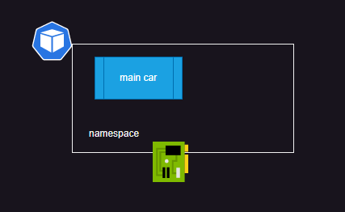
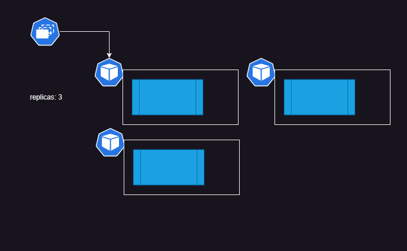

# Kubernetes Major Workloads

## Pod

* [Refer Here](https://kubernetes.io/docs/concepts/workloads/pods/) for official docs
* Pods will have one or more containers
* Each Pod gets an IP Address which is shared to the container(s)
* Pods will two types of containers in it
  * **init containers:** They are created in a sequence and they are expected to finish in some finite time. Generally we do precondition checks over here
  * **containers:** These are where we run our application images and they should run forever and they are created in parallel
* In Pod the desired state is containers, when containers fail k8s will continuously restart containers
* There is one more type of container called as **ephemeral container** which is used for debugging purposes

---

# Controllers

## ReplicaSet

* [Refer here](https://kubernetes.io/docs/concepts/workloads/controllers/replicaset/) for replicasets

---

### Deployment

* [Refer Here](https://kubernetes.io/docs/concepts/workloads/controllers/deployment/) for deployment

---

### Daemonset

* This will create a pod on every node (or selected nodes) in k8s cluster
* [Refer Here](https://kubernetes.io/docs/concepts/workloads/controllers/daemonset/)

---

### Statefulset

* Statefulsets are used to run stateful applications and they have capability to manage volumes as well

---

### Label

* this is a key value pair which can be attached to any k8s object
* k8s can query objects with the help of labels

---

### Service

* [Refer Here](https://kubernetes.io/docs/concepts/services-networking/service/) for official docs

---

# Kubernetes API Server and Clients

* kubectl uses config in ~/.kube/config to get the cluster information and secrets to connect with api server [Refer Here](https://kubernetes.io/docs/reference/kubectl/)
* kubectl command line tool cheatsheet [Refer Here](https://kubernetes.io/docs/reference/kubectl/quick-reference/)
* kuberentes also provides client libraries in various languages [Refer Here](https://kubernetes.io/docs/reference/using-api/client-libraries/)
* kubectl has two styles of resource creation
  * **Imperative:**
    * we construct a command to create a resource
    * quick and convient way to perform one time or infrequent operations.
  * **Declarative:**
    * We write a manifest in yaml format with our desired state
    * Declarative way is useful for automation, repetition and having history of changes
* Kubernetes api versioning scheme [Refer Here](https://kubernetes.io/docs/reference/using-api/#api-versioning)
* To group releated resources k8s use apiGroups [Refer Here](https://kubernetes.io/docs/reference/using-api/#api-groups)
  * core
  * apps
  * batch
  * …

* API Version: APIGROUP/version for all groups other than core. For core the APIVERSION = version
* When we are writing manifest we specify (generally)
  * apiVersion: Api version of Resource
  * kind: Type of Resource
  * metadata: name and labels
  * spec: here we define what we want
* Once we execute this kuberentes adds the fifth field status
