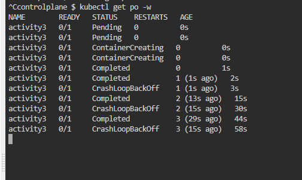
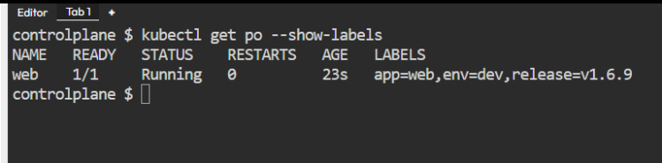

YAML
----

* This is data representation format
* YAML uses key value or name value pairs to represent data
* values can be of following types
  * simple/scalar
    * text
    * number
    * bool
  * complex
    * list/array
    * map/dictionary/object
* YAML syntax is heavily inspired from  python and json (javascript object notation)
* YAML files will have extension of .yaml or .yml
* yaml basic syntax

key: < value >

* Sample YAML

```yaml
---
title: "Venom The Last Dance" # Text
year: 2024 # number
budget: 110.5 # number
imaxRelease: yes # boolean
genre: # list
  - Action
  - Adventure
  - Fantasy
  - Sci-Fi
starcast: # object
  Venom: Tom Hardy # Text
  Military Member: Chiwetel Ejiofor # Text
  Scientist: Juno Temple # Text
```

---
## Writing Kubernetes Manifests

* Kuberentes manifests are strictly structured by api-references
* [Refer Here](https://kubernetes.io/docs/reference/) for reference pages and [Refer Here](https://kubernetes.io/docs/reference/generated/kubernetes-api/v1.31/) for 1.31 api reference

* Hello Pod
* Lets start by writing a pod which will run nginx container
* [Refer Here](https://github.com/rithwiksrivastav4/kubernetes/blob/main/hello-pods.yml) for changeset

```yaml
---
apiVersion: v1
kind: Pod
metadata:
  name: hello-pod
spec:
  containers:
    - name: web
      image: nginx:1.27
```

* To create pods from manifest 

```bash
 kubectl apply -f <filename.yaml>
```

* To get basic information

```bash
kubectl get pods <pod-name>
```

* to get little more info

```bash
kubectl get pods <pod-name> -o wide
```

* To get detailed information

```bash
kubectl describe pods <pod-name>
```

* To get podinfo in yaml format

```bash
kubectl get pods <pod-name> -o yaml
```

* To watch the changes

```bash
kubectl get pods -w
```

## Create a Pod with two containers

* pod name activity-2
* containers:
  * ngnix
  * alpine with command sleep 1d

```yaml
---
apiVersion: v1
kind: Pod
metadata:
  name: activity-2
spec:
  containers:
    - name: web
      image: nginx:1.27
    - name: sidecar
      image: alpine
      args: # cmd
        - sleep
        - 1d
```

* [Refer Here](https://github.com/rithwiksrivastav4/kubernetes/blob/main/two-container.yaml)

## Activity 3: Writing a Pod with a container with exits

* K8s tries restarting pod after crashloopbackoff

[Refer Here](https://github.com/rithwiksrivastav4/kubernetes/blob/main/activity2.yaml) for changes
* in the arguments lets pass sleep 10s

### Init containers

* These represent checking for preconditions

### Activity 4:

* Lets write a pod spec with nginx and alpine with sleep 1d
* init containers
  * init1 alpine with sleep 10s
  * init2 alpine with sleep 10s

[Refer Here](https://github.com/rithwiksrivastav4/kubernetes/blob/main/activity2.yaml) for spec

### Activity 5

* create a pod with
  * container:
    * name: test
    * image: alpine
    * args: sleep 1d

* we need to pass the following environmental variables

  * USERNAME = admin
  * PASSWORD = admin@123

* equivelent docker command

```bash
docker run -e "USERNAME=admin" -e "PASSWORD=admin@123" alpine sleep 1d
```

* [Refer Here](https://github.com/rithwiksrivastav4/kubernetes/blob/main/activity1.yaml)


* Lets start adding labels
* [Refer Here](https://kubernetes.io/docs/concepts/overview/working-with-objects/labels/) for official docs
* lets create a pod with nginx container and labels
  * env: dev
  * app: web
  * release: v1.6.9

```yaml
---
apiVersion: v1
kind: Pod
metadata:
  name: web
  labels:
    env: dev
    app: web
    release: v1.6.9
spec:
  containers:
    - name: web
      image: nginx:1.27
```



---

## Label selectors
[Refer Here](https://kubernetes.io/docs/concepts/overview/working-with-objects/labels/#label-selectors) for official docs