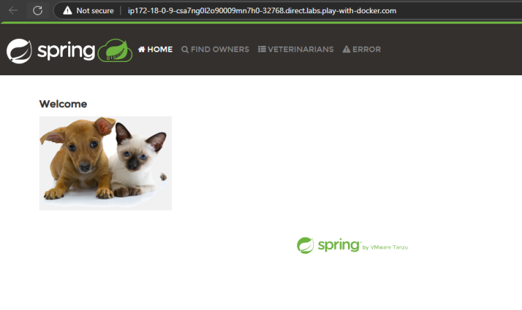
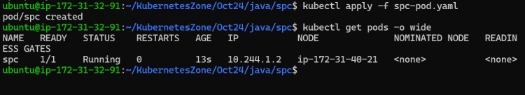
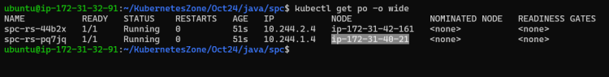
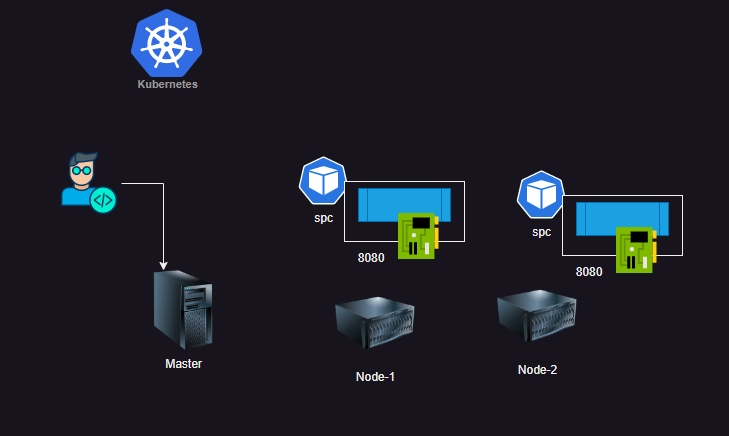
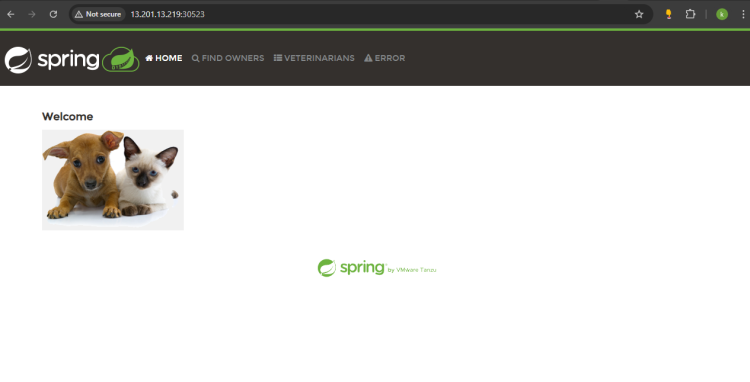
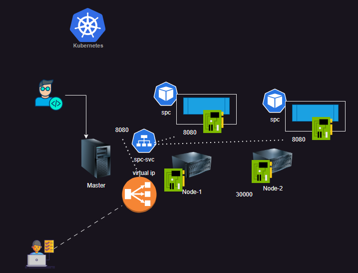

# Running applications in Pods

## spring petclinic

* This application is developed in java using spring boot
* this application runs on port 8080
* image: shaikkhajaibrahim/spcjan2024:1.0
* port: 8080
* docker command

```bash
docker run --name spc -d -P shaikkhajaibrahim/spcjan2024:1.0
```



* [Refer Here](https://github.com/rithwiksrivastav4/kubernetes/commit/75af7b4c0eabe8e546b2bbe5b99b0842a341e6dc) for pod specification with port info added

* Note: Exposing Pod directly to external world is not a recommended practice, we are using the following only for evaluation
* Generally while creating containers it is a good idea to define the cpu and memory limits [Refer Here](https://directdevops.blog/2019/10/07/docker-logging-docker-memory-cpu-restrictions/) for article

```bash
docker run --name spc -d -P --memory "512m" --cpus="0.5" shaikkhajaibrahim/spcjan2024:1.0
```

* [Kubernetes](https://kubernetes.io/docs/concepts/configuration/manage-resources-containers/) also has **limits and requests to support allocating upper and lower bound for memory, cpu** and other restrictions [Refer Here](https://kubernetes.io/docs/concepts/configuration/manage-resources-containers/)

* [Refer Here](https://github.com/rithwiksrivastav4/kubernetes/commit/0cd9588aa26172e668d4942f5b8d390dc6f88b43) for the changes done in the specification to include
  * **lower limits for cpu and memory**
  * **upper limits for cpu and memory**

* Label selector [Refer Here](https://kubernetes.io/docs/concepts/overview/working-with-objects/labels/#label-selectors)
* Lets create multiple pods i.e. lets use replicaset [Refer Here](https://github.com/rithwiksrivastav4/kubernetes/commit/7cd0014e76e07768536a6087f85fbcf077ad0d60) for changes done




## Service

* Service is a k8s object which creates a virtual ip address and a DNS Name which is fixed.
* To make this service accessible kube-proxy and CORE DNS will do the job of forwarding/making service accessible
* in every container we have a file /etc/resolve.conf
* Services are of different types
  * Cluster Ip (ip address within k8s cluster)
  * Node Port (Expose service on some port on all nodes of k8s cluster)
  * Load Balancer (Used in Managed k8s clusters)
  * ExternalName (It gives a DNS Record)
* when we create a service, it creates endpoints, Each endpoint represents a podip with port
* [Refer Here](https://kubernetes.io/docs/concepts/services-networking/service/) for service
* [Refer Here](https://github.com/rithwiksrivastav4/kubernetes/commit/4739e3553d960d1a4b87e3aa92e3513b39b43774) for the changes done

* Overview

