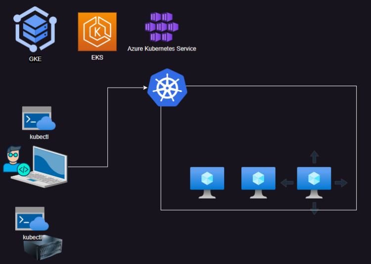
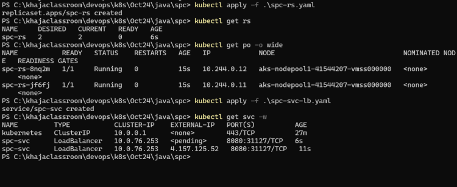
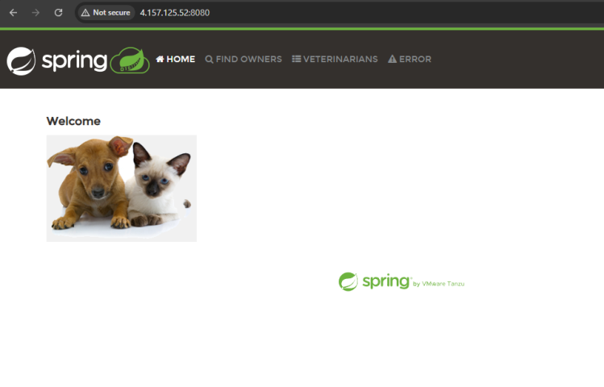
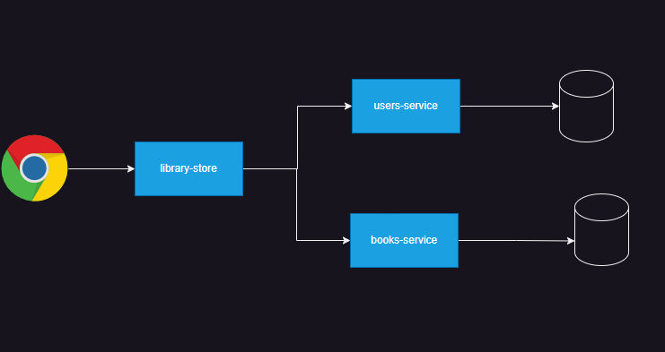
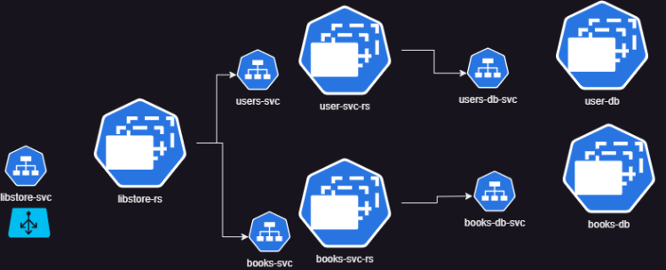
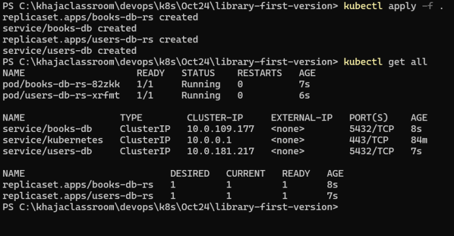
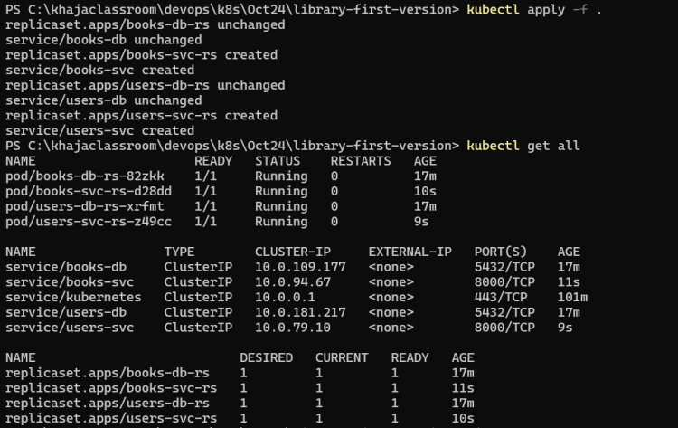
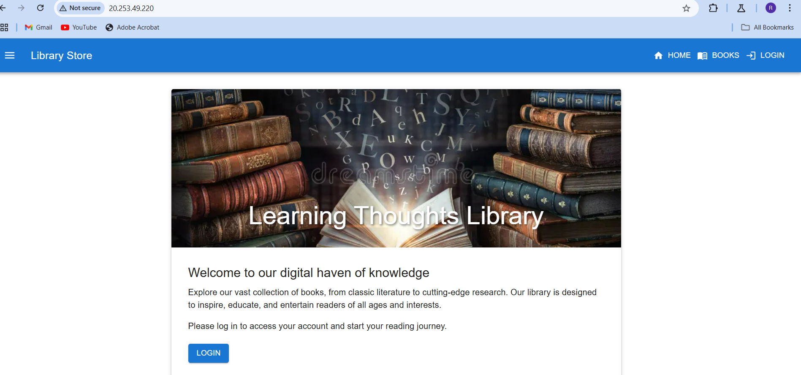

# Managed Kubernetes clusters

* Cloud providers offer managed kubernetes clusters
* Cloud providers manage the control plane i.e. we need not install  k8s and the control plane will be a black box Google Cloud Platform training


----

# Azure Kubernetes Services (AKS)

* AKS is managed k8s offered by Azure [Refer Here](https://learn.microsoft.com/en-us/azure/aks/what-is-aks)
* Lets setup AKS Cluster
* Pre-reqs:
  * Azure CLI is installed and configured
[Refer Here](https://learn.microsoft.com/en-us/azure/aks/learn/quick-kubernetes-deploy-cli) for steps
* **Azure cli user data**

```bash
#!/bin/bash
sudo apt-get update
sudo apt-get install apt-transport-https ca-certificates curl gnupg lsb-release -y
sudo mkdir -p /etc/apt/keyrings
curl -sLS https://packages.microsoft.com/keys/microsoft.asc |
  gpg --dearmor | sudo tee /etc/apt/keyrings/microsoft.gpg > /dev/null
sudo chmod go+r /etc/apt/keyrings/microsoft.gpg
AZ_DIST=$(lsb_release -cs)
echo "Types: deb
URIs: https://packages.microsoft.com/repos/azure-cli/
Suites: ${AZ_DIST}
Components: main
Architectures: $(dpkg --print-architecture)
Signed-by: /etc/apt/keyrings/microsoft.gpg" | sudo tee /etc/apt/sources.list.d/azure-cli.sources
sudo apt-get update
sudo apt-get install azure-cli -y
```

* Commands to create **AKS cluster from bash (linux/mac)**

```bash
# variables 
export MY_RESOURCE_GROUP_NAME="myAKSResourceGroup"
export REGION="eastus"
export MY_AKS_CLUSTER_NAME="myAKSCluster"
export MY_DNS_LABEL="mydnslabel"
# Create a resource group
az group create --name $MY_RESOURCE_GROUP_NAME --location $REGION
az aks create --resource-group $MY_RESOURCE_GROUP_NAME --name $MY_AKS_CLUSTER_NAME --node-count 1 --node-vm-size "Standard_B2ms" --generate-ssh-keys
# install kubectl
az aks install-cli 
# get kube config
az aks get-credentials --resource-group $MY_RESOURCE_GROUP_NAME --name $MY_AKS_CLUSTER_NAME
```

* Commands to create **AKS cluster from powershell** using Azure CLI

```bash
$MY_RESOURCE_GROUP_NAME="myAKSResourceGroup"
$REGION="eastus"
$MY_AKS_CLUSTER_NAME="myAKSCluster"
$MY_DNS_LABEL="mydnslabel"
az group create --name $MY_RESOURCE_GROUP_NAME --location $REGION
az aks create --resource-group $MY_RESOURCE_GROUP_NAME --name $MY_AKS_CLUSTER_NAME --node-count 1 --node-vm-size "Standard_B2ms" --generate-ssh-keys
az aks install-cli 
az aks get-credentials --resource-group $MY_RESOURCE_GROUP_NAME --name $MY_AKS_CLUSTER_NAME
```

* To delete the cluster

```bash
az group delete --resource-group $MY_RESOURCE_GROUP_NAME --yes --no-wait
```

## Lets deploy spc using replicaset and a service of type load balancer

* [Refer Here](https://github.com/rithwiksrivastav4/kubernetes/blob/main/java/spc/spc-svc-lb.yaml) for changes



----

# Library Application

* Architecture

* Technical stack
  * users-service: REST API
    * python
    * fast api
  * user-db:
    * postgres
  * books-service: REST API
    * python
    * fast api
  * user-db:
    * postgres
  * library-frontend:
    * react js
* To run **books database:**
  * image: postgres:15-alpine
    * environmental variables:
    * POSTGRES_USER: user
    * POSTGRES_PASSWORD: password
    * POSTGRES_DB: booksdb
  * port: 5432

* To run **books service:**
  * image: shaikkhajaibrahim/libbookssvc:1.0
    * environmental variables:
    * DATABASE_URL: “postgresql://:@:5432/“
    * SECRET_KEY: ‘YtDEVWnL35aAIP-5yxeLjAZ49R920-mMNDfwPyWULu63HFsYzo0f-LO2InxC8eu428k’
  * port: 8000

* To run **user database:**
  * image: postgres:15-alpine
    * environmental variables:
    * POSTGRES_USER: user
    * POSTGRES_PASSWORD: password
    * POSTGRES_DB: usersdb
  * port: 5432

* To run **users servics:**
  * image: shaikkhajaibrahim/libuserssvc:1.0
    * environmental variables:
    * DATABASE_URL: “postgresql://:@:5432/“
    * SECRET_KEY: ‘YtDEVWnL35aAIP-5yxeLjAZ49R920-mMNDfwPyWULu63HFsYzo0f-LO2InxC8eu428k’
  * port: 8000

* To run **library webstore:**
  * image: shaikkhajaibrahim/libwebstore:1.0
    * environmental variables
    * REACT_APP_BACKEND_API_URL: http://:8000/api/v1
    * REACT_APP_BOOKS_API_URL: http://:8000/api/v1/books
    * REACT_APP_USERS_API_URL: http://:8000/api/v1/users
  * port: 3000


----

## First Version of Library

* Lets create a *users database replicaset*
* Lets create a *books database replicaset*

* [Refer Here](https://github.com/rithwiksrivastav4/kubernetes/commit/3f1d3e40bec55dbd68aabdbdeb04167dd2d36557) **user db** and [refer here](https://github.com/rithwiksrivastav4/kubernetes/commit/d880cd847e1ce21b40a4758ba0e2b8e344904e09)for **books db** yaml files
* Now lets create **repelicaset for users service and books service** [Refer Here](https://github.com/rithwiksrivastav4/kubernetes/commit/186a9bdd0bf0c225a3e6cad1aad1170f01e3e5fa) for changes of **books service** and [refer here](https://github.com/rithwiksrivastav4/kubernetes/commit/bf3df02bdbc6a1f3e62771bc29bc3a60890731b3) for **users service** yaml file

* Lets add **rs and service for library store** [Refer here](https://github.com/rithwiksrivastav4/kubernetes/commit/25118d0aa51ac69088a368fe30e1e1ebfc1b0ad4) for **library store** yaml file

* To create a admin user run this from any container

```bash
curl -X 'POST' \
  'http://users-svc:8000/api/v1/users/' \
  -H 'accept: application/json' \
  -H 'Content-Type: application/json' \
  -d '{
  "username": "qtdevops",
  "email": "admin@admin.com",
  "user_type": "administrator",
  "password": "admin@123"
}'
```
