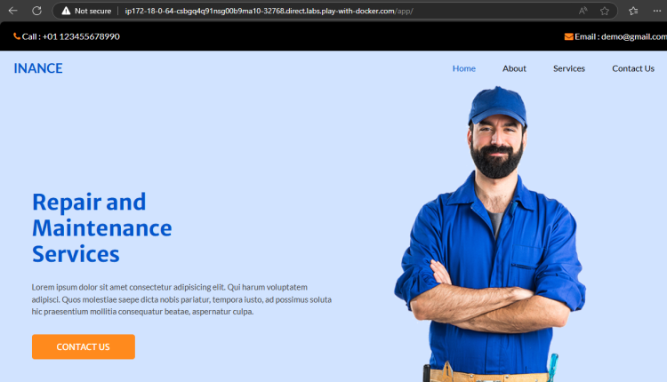
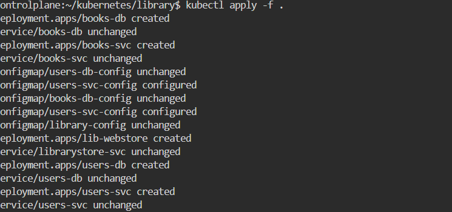
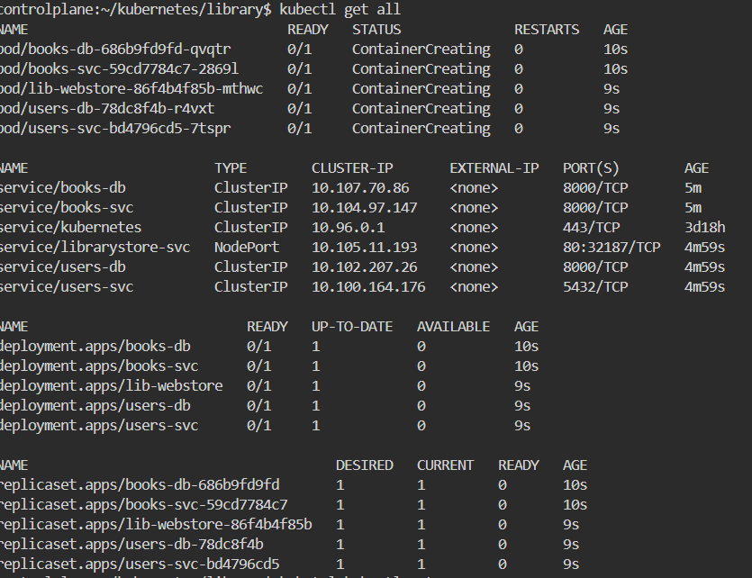
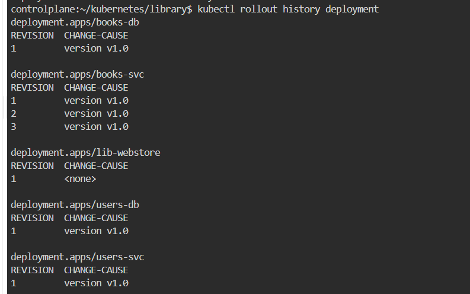
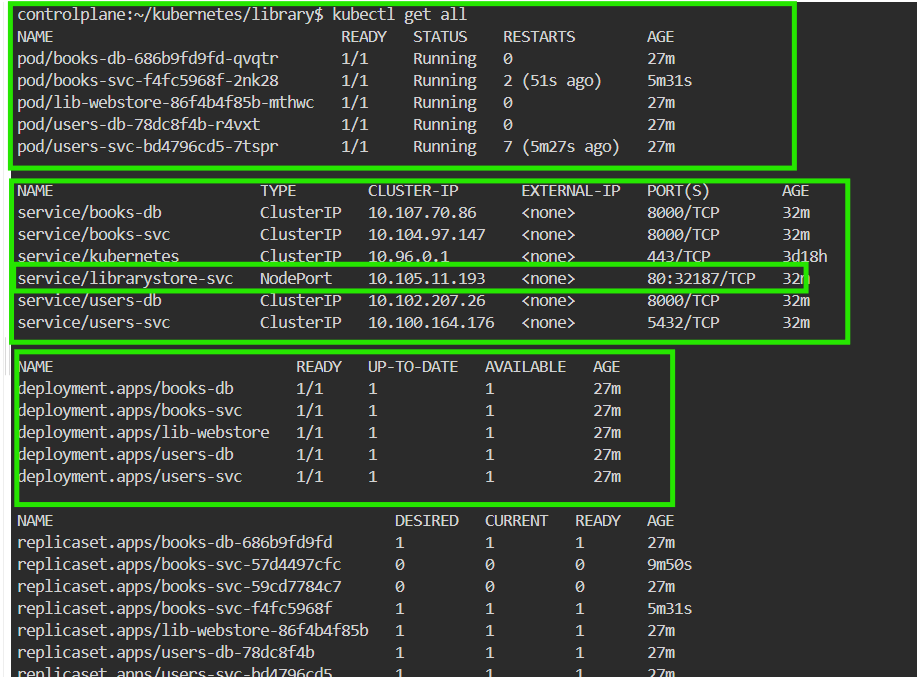

Phippy Goes to Zoo
------------------

[Refer Here](https://azure.microsoft.com/mediahandler/files/resourcefiles/phippy-goes-to-the-zoo/Phippy%20Goes%20To%20The%20Zoo_MSFTonline.pdf) for the story book

# Deployments

[Refer Here](https://kubernetes.io/docs/concepts/workloads/controllers/deployment/) for official docs

* Deployments create replica sets, replicasets create pods which in turn runs the containers
* Deployments are suitable for stateless applications
* Deployments come with two strategies
  * Recreate
  * RollingUpdates (Default)
* In Rolling updates
  * We can rollout New versions
  * undo rollout (rollbacks)

----

## To understand Deployments

* Lets use image shaikkhajaibrahim/dmtest
* Application runs of /app on port 80
* tag 1.0

* tag 2.0

* tag 3.0


----

* Lets create a Deployment with 4 replicas of version 1.0 with a service exposed to external world

* [Refer Here](https://github.com/rithwiksrivastav4/kubernetes/blob/main/deployment/web-deploy.yaml) for the manifests to deploy version 1.0

* For deployment to record the change cause lets use the annotation [Refer Here](https://kubernetes.io/docs/reference/labels-annotations-taints/#change-cause)

* To execute the deployement k8s commands

```bash
kubectl apply -f deploy.yaml
```

* To rollout the new version the deployement use this command

```bash
kubectl rollout status deployements < filename>
```



* To see the service and port details

```bash
kubectl get svc
```





* To rollback the update

```bash
kubectl rollout undo deployement <filename>
```

* To find the deployment status we use kubeclt rollout
* To access the application externally use nodeport or loadbalancer
* To deploy the new version change the tag and change cause annotation

* Exercise:
  * Convert
    * users-service from replicaset to deployment
    * books-service from replicaset to deployment
    * library-web-store from replicaset to deployment

* Annotations
* [Refer Here](https://kubernetes.io/docs/concepts/overview/working-with-objects/annotations/) for official docs
* Annotations add metadata to objects which are generally used by tools
